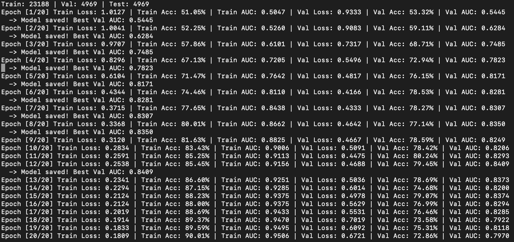
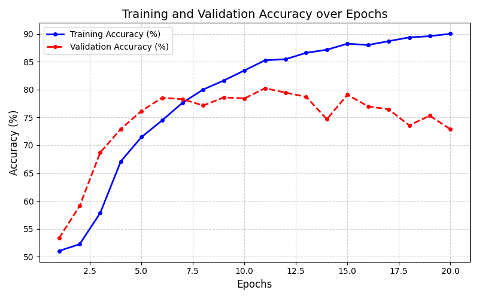
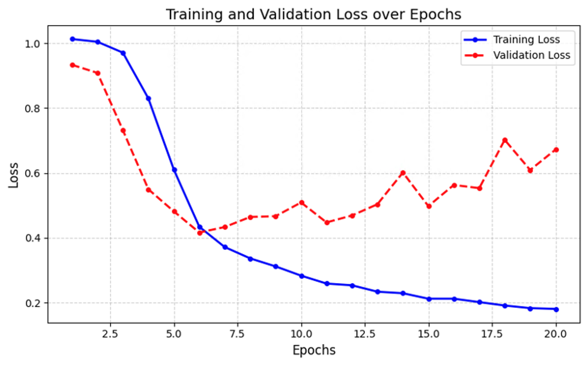
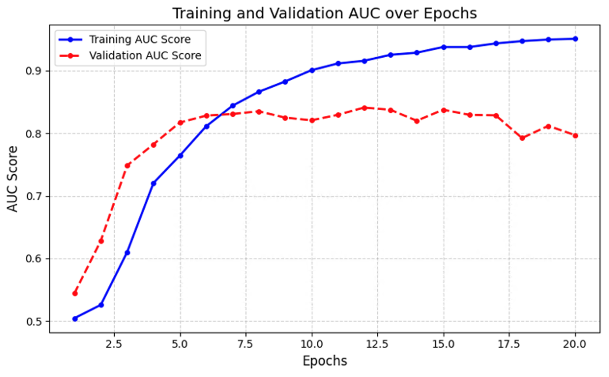
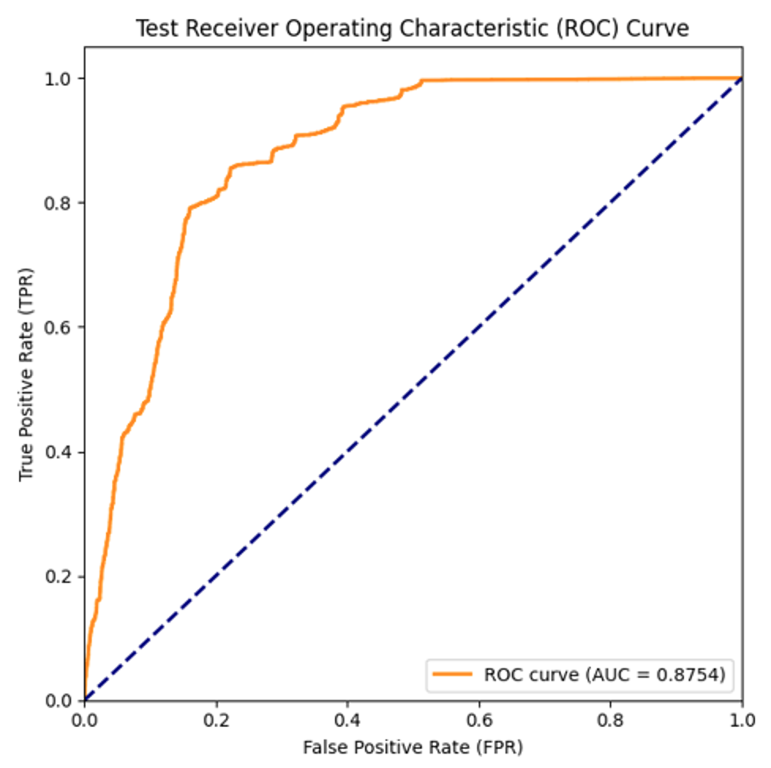
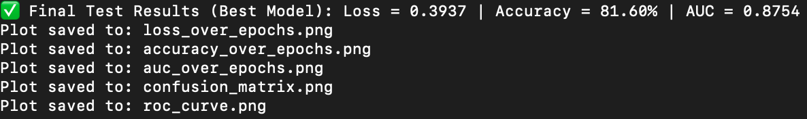

# **Siamese Network for Classifying Skin Cancer (Using ISIC 2020 Kaggle Challenge Dataset)**
**Author:** Danny Ly  
**StudentID:** 48835606


## Introduction
### Problem Statement
Melanoma is the most dangerous type of skin cancer, with the highest incidence rates in Australia and New Zealand. However, melanoma can usually be cured with surgery when identified in its early stages. So, this project aims to assist with quicker and more accurate detection of melanoma given an image of skin. 

### Algorithm Description and How It Works
The algorithm that will be used to classify melanoma will be a Siamese Neural Network. A Siamese Network usually consists of two identical neural networks (that same the same weights and parameters) but are given two different inputs. These inputs each return an output vector (embedding) that represents the image. This embedding goes through a distance layer to measure the similarity between the two. The embeddings with small distances between them are usually from the same class and further distances signify different classes. 


## File Structure
Immediately after cloning:
```
PatternAnalysis-2024/recognition/4883560_something_model/
│
├── assets/
│   ├── image1.png
│   ├── image2.png
│   └── ...
│
├── dataset.py
├── modules.py
├── predict.py
├── train.py
└── README.md
```
The cloned repository <u>**does not**</u> include the dataset. The code below stored its dataset in a high-performance computing cluster (Rangpur) instead of local storage. So, ensure the images and metadata path are correctly implemented based on the location of your dataset. 


## Dataset and Pre-processing
### Dataset Introduction
The dataset used was provided from the ISIC 2020 Kaggle Challenge Dataset. This included 33,126 unique images, of which 98% (32,542) are benign and 2% (584) are malignant. The full original dataset can be found here: https://challenge2020.isic-archive.com/. However, due to the dataset size and available personal storage, a resized (224x224) version of the dataset was used instead which can be found here: https://www.kaggle.com/datasets/nischaydnk/isic-2020-jpg-224x224-resized. To store the data, Rangpur was used under the directory of `(/home/Student/{student_id}/project/)` which included all the images in the `train-image` folder and the metadata in the `isic_metadata` folder. 


### Data Splitting
The data was split into 3 groups with the following ratios:
- Training Data 70% (23188): Used to train the model. 
- Validation Data 15% (4969): Used to assist with tuning the model and indicate the performance on unseen data. 
- Testing Data 15% (4969): Used to evaluate the final model on unseen data. 

The 70/15/15 split is a standard split to balance the test and validation data while maximising the performance of the model by giving it more data to train [[5](#References)]. 


### Data Oversampling
To combat the significant class imbalance between benign and malignant images, weighted random sampling was used to ensure the model is trained on balanced data. Higher weights would be applied to the less frequent classes (malignant) to increase the probability of being chosen when randomly selecting pairs [[6](#References)].


### Data Augmentation
Data augmentation was used to reduce overfitting and help the model generalize features. The augmentations that was used, were chosen because of their common uses in other medical imaging research [[7](#References)].
- `Resize`: Resizes the image (used for consistency).
- `RandomHorizontalFlip`: Randomly flips the image horizontally. 
- `RandomVerticalFlip`: Randomly flips the image vertically.
- `ColorJitter`: Randomly applied color changes such as the brightness, contrast, ect.
- `RandomRotation`: Randomly rotates the image to a certain degree.
- `Normalize`: Normalises pixel values of the image.

**Note:** Two different augmentations were applied to the training data and validation and test data. The validation and test data augmentations did not have any transformations applied other than `Normalize` which has the same mean and std.


## Siamese Model Overview
### Siamese Network
As discussed above, a Siamese network consists of two main components, the CNN model and the loss function. The CNN model used for this project is a ResNet-50 CNN (which can be seen below) that is pre-trained on ImageNet data to have a some basic image detailed already learnt. More information can be found here: https://docs.pytorch.org/vision/main/models/generated/torchvision.models.resnet50.html. This significantly reduces training time required, amount of data, and is a reliable base to build off [[8](#References)]. 


However, the ResNet-50 CNN is the backbone of the Siamese network and is modified to skip the classification process and instead return 2048-dimensional embedding instead. This embedding undergoes another block/head that will reduce the it to 64-dimensions. This is then normalized so that the embedding lies on a unit sphere so the distances can be measured.


### Contrastive Loss Function
The Constrastive loss function is one of the main loss functions used in Siamese networks . It evaluates how well the network is able to distinguish between two images [[1](#References)]. The formula follows:

$$
Loss = (1 - Y) \cdot \frac{1}{2}(D_w)^2 + Y \cdot \frac{1}{2}\left[\max(0, m - D_w)\right]^2
$$

Where:
- $D_w$ is the Euclidean Distance
- $Y$ is either 1 or 0 (1 being not from the same class, 0 otherwise)
- $m$ is a margin value (ensures any dissimilar pairs greater will not contribute to the loss)


## Training Details
### Hyperparameters
These hyperparameters were used after extensive testing to result in the best outcome.
- `Epochs` = 20 (to show model after its peak)
- `Batch Size` = 32
- `Pairs per epoch` = 15000
- `Criterion` = Custom Contrastive Loss Function (with a margin of 1.5)
- `Optimizer` = Adam (with a learning rate of 1e-5 and weight decay of 1e-4)
- `Scheduler`= CosineAnnealingLR (with a max iteration count of 20 and min learning rate of 1e-6)


### Training Process
The best performing model (highest validation accuracy) will have its information saved on the path `best_siamese_model.pth`. This will be used when evaluating against new images.


## Evaluation Details
### Hyperparameters
Follows the same hyperparameters (such as batch size and pairs per epochs) where applicable but copies most parameters from the best performing model from training.


### Evaluation Figures
The following figures will be created:
1. Testing Confusion Matrix
    - Demonstrates the performance against actual outcomes
2. Receiver Operating Characteristics Curve (ROC)
    - Demonstrates the trade-off between sensitivity and specificity


## Results
### Raw Training and Validation Output



### Training Diagrams
#### 1. Training and Validation Accuracy/Loss/AUC ROC Over Epochs






#### Training and Validation Discussion
As seen in the raw output and diagrams, the training and validation curve followed the same pattern in the early epochs which indicates little overfitting and the model is learning well. However, after the 6-7th epoch, the training and validation trends begin diverging. This is likely due to overfitting with the model memorising the dataset rather than learning new features. Nonetheless, during evaluation, the best model (highest validation accuracy) will be used before the model began overfitting.

### Evaluation Diagrams
#### 1. Testing ROC Curve


A curve that follows the diagonal line indicates the model cannot distinguish the difference between classes confidently. As the image above shows the curve towards the corner with higher positive rates and low false positives, the model can confidently distinguish between benign and malignant images. However, this can certainly be improved upon as it doesn't fully reach the top-left corner of the diagram.

#### 2. Testing Confusion Matrix


#### Testing Discussion

Final Test Results:
- `Loss = 0.3937`
- `Accuracy = 81.60% `
- `AUC = 0.8754`

The overall evaluation of the model did exceed the desired accuracy of 0.8 as seen with the general accuracy metric and Area Under the ROC Curve (AUC) both being greater. 


## Dependencies and Setup
- python: 3.13.7
- torch: 2.7.1
- torchvision: 0.22.1
- sklearn: 1.7.2
- numpy: 2.1.2
- pandas: 2.3.3
- matplotlib: 3.10.6
- PIL: 11.0.0

## References
- [1] Description of how a Siamese Network works. Available at: https://medium.com/@rinkinag24/a-comprehensive-guide-to-siamese-neural-networks-3358658c0513
- [2] Image of the basic structure of a Siamese Network. Available at: https://www.mdpi.com/2073-8994/10/9/385 
- [3] Raw dataset used. Available at: https://challenge2020.isic-archive.com/
- [4] Dataset used. Available at: https://www.kaggle.com/datasets/nischaydnk/isic-2020-jpg-224x224-resized
- [5] Dataset splitting. Available at: https://wiki.cloudfactory.com/docs/mp-wiki/splits/data-splitting-in-machine-learning
- [6] Weighted Random Sampling. Available at: https://www.researchgate.net/publication/47860855_Weighted_Random_Sampling_over_Data_Streams
- [7] Data Augmentation applied. Available at: https://www.sciencedirect.com/science/article/pii/S277244252400042X
- [8] Benefits of pre-trained models. Available at: https://www.ibm.com/think/topics/pretrained-model